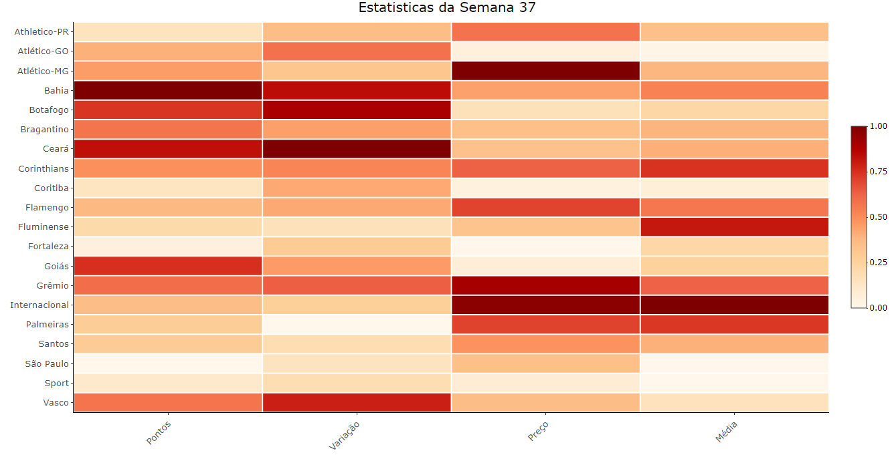

# Gato Mestre

Este projeto tem como objetivo fazer uma análise exploratória sobre os comportamentos dos cartoleiros em relação a escalações para a semana 38 e analisar alguns confrontos entre goleiros e atacantes. Para desenvolvimento, foi utilizada a linguagem R.

# Apresentação

A última rodada do Campeonato Brasileiro chegou. Campeonato este que começou em um ano que foi marcado por uma pandemia mundial. A Covid-19 impactou a sociedade em todos os sentidos, e o futebol infelizmente não ficou de fora. Apesar dos impedimentos, jogadores e comissões técnicas que perderam partidas por estarem com suspeita ou contaminados com o vírus, treinos afetados, entre outras implicações, o esporte deu a volta por cima, se organizou e conseguiu nos entregar alegria em um ano tão atípico.

Nesta semana, não descobriremos só o vencedor do Brasileirão, como também os vencedores das Ligas do Cartola FC. Muitas delas estão assim como o Campeonato: serão decididas no último momento. Seguem alguns insights para auxiliar a escalação desta rodada.

## Principais estatísticas por Clube na Semana 37

Este heatmap (mapa de calor) representa as principais estatístiscas por Clube na última rodada. Como as variáveis analisadas possuem escalas diferentes ("Pontos", "Variação" e "Média" em número de pontos e "Preço" em $), os dados passaram por um processo chamado normalização, que os coloca em uma única escala para que possam ser analisados em um mesmo gráfico. Esta escala varia de 0 a 1, ou seja, o gráfico pode ser analisado da seguinte forma: quanto mais escura a cor, maior é o valor. Assim como quanto mais clara, menor o valor. Um exemplo é o Internacional, equipe com o tom mais escuro na variável preço. Quer dizer que a equipe possui o time mais caro, na semana analisada. Já o São Paulo possui o tom mais claro na variável Pontos, ou seja, foi a equipe que menos marcou na semana 37.

## Destaques para a Semana 38

Os 20 destaques (mais escalados da rodada) foram representados em soma por clube e por posição. Os gráficos de pizza a seguir servem para analisar o comportamento dos Cartoleiros. Pode-se interpretar o gráfico considerando que cada cor do gráfico representa um Clube e uma Posição, respectivamente.

O Flamengo possui maior número de escalações dentre os 20 destaques da rodada. O número de apostas pode ser explicado pelo fato de que a equipe pode ser campeã do Campeonato Brasileiro na partida desta quinta-feira, então as chances de bom desempenho são altas. Dos jogadores mais escalados da rodada, 35% são da equipe carioca, sendo Gabigol o mais escalado, marcando presença em 640.724 times do Cartola.

O Fluminense, time com o segundo maior número de escalações na rodada, também terá um jogo decisivo esta semana. No domingo, a equipe enfrentará o Fortaleza em partida que pode garantir a classificação direta para a fase de grupos da Libertadores. O jogador mais escalado do time é o lateral Calegari, com 382.907.

Já o Internacional, equipe com terceiro maior número de escalações, precisa vencer e depender de um tropeço do Flamengo para se tornar o campeão do Campeoanto Brasileiro. O meia Patrick foi o mais escolhido entre os jogadores do Inter, com 347.373.

Atacantes e meias foram as principais escolhas dos cartoleiros para esta semana. São as posições que possuem maior probabilidade de fazer gols, o que garante maior pontuação no Cartola.

## Análise dos Goleiros

Para dar início a análise dos confrontos, uma visão geral das estatísticas dos goleiros durante o Campeonato.

Agora vamos dar uma olhada na pontuação dos goleiros da última rodada (em laranja, à esquerda) e comparar com a média de desempenho (em azul, à direita). Lembrando que há possibilidade de pontuação negativa, por este motivo, algumas barras estão para baixo.

## Análise dos Atacantes

E para iniciar a análise dos atacantes, vamos verificar a relação entre preço e média destes jogadores.

Podemos interpretar este gráfico como uma correlação positiva, ou seja, quando uma variável aumenta (média) a outra variável também aumenta (preço). 

Ainda verificando relação entre variáveis, vamos visualizar utilizando "Gols" e "Preço".

Aqui também é possível afirmar que há correlação positiva, assim como no gráfico Média x Preço. Importante ressaltar que correlação não significa causalidade. Não é porque duas variáveis estão aumentando de valor ao mesmo tempo, que uma causa o aumento da outra. O preço de um jogador pode aumentar por diversos fatores, e não porque (ou só porque) ele marca mais gols.

Agora uma visão de algumas estatísticas dos atacantes que possuem média maior que 4. O dataset com todos os jogadores e variáveis (atacantes_final) se encontra neste mesmo repositório, na pasta "datasets".

## Análise dos Confrontos

Após visualização das estatísticas dos goleiros e atacantes, podemos analisar os principais confrontos da rodada, trazendo dados para auxiliar na tomada de decisão do Cartoleiro.

##### Luciano (Internacional) x Hugo Souza (Flamengo)

Hugo deixou de sofrer gol em 6 dos 19 jogos e sofreu apenas 15, 3ª melhor marca entre os goleiros prováveis para a semana. Já Luciano participou de 26 jogos nesta temporada, somando 15 gols, 1 assistência e média de 6,14 no Campeonato.

##### Yuri Alberto (Internacional) x Cassio (Corinthians)

O Internacional precisa ganhar e torcer para um tropeço do Flamengo para ser o campeão do Campeonato Brasileiro. Yuri Alberto, que participou de 22 jogos, tem média de 4,84, soma 10 gols e 1 assistências e custa apenas R$4,92. Do outro lado, Cássio é o segundo pior goleiro do Brasileirão em relação a média de pontos, com 0,97 e sofreu 34 gols em 25 jogos.

##### Ricardo Oliveira (Coritiba) x Jean (Atlético-GO)

Os 3 atacantes do Coritiba prováveis para a rodada estão entre os 4 com menor média no Campeonato Brasileiro. Ricardo Oliveira, com 1.23, Guilherme Biro, com 0.15, e Osman, com -0.03. Ricardo Oliveira foi o único que marcou gol, mas apenas 1 em 16 jogos. Do lado do Atlético-GO, é o segundo goleiro com maior média (5.32) e o segundo que mais disputou partidas (33). Jean ainda tem a melhor marca disparado em defesas difíceis, com 48. A nível de comparação, o segundo lugar é de Tadeu, do Goiás, com 37.
